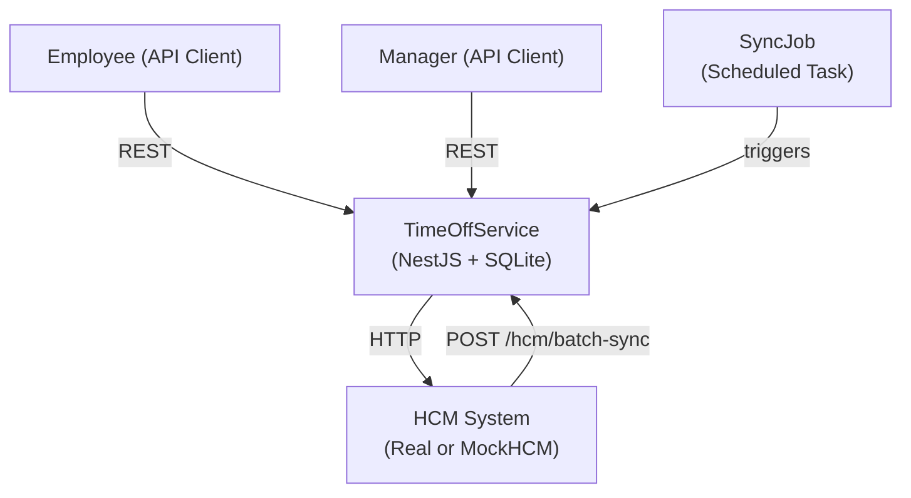
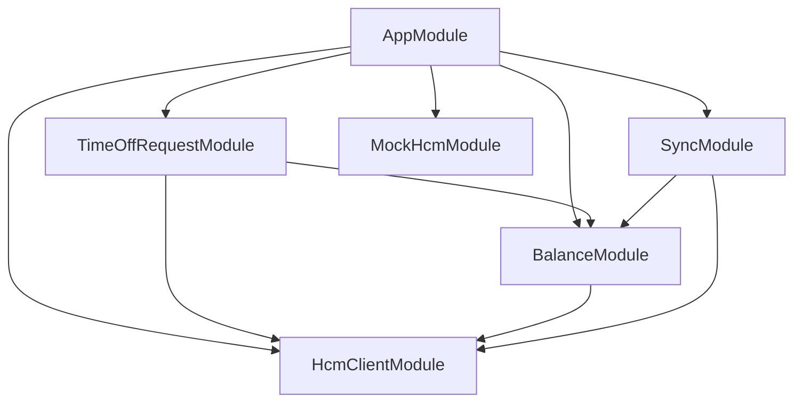
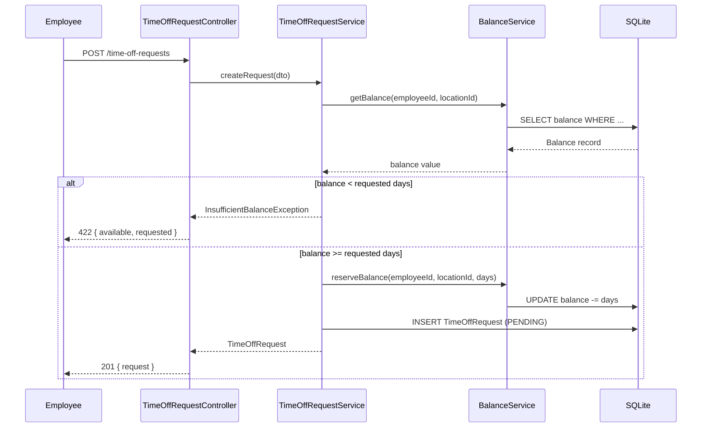
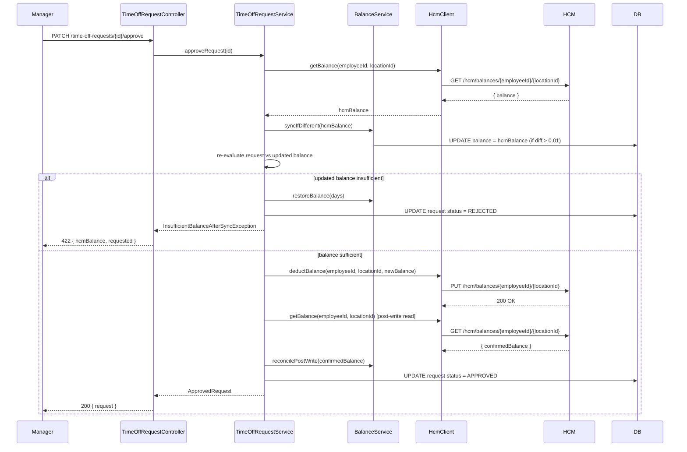
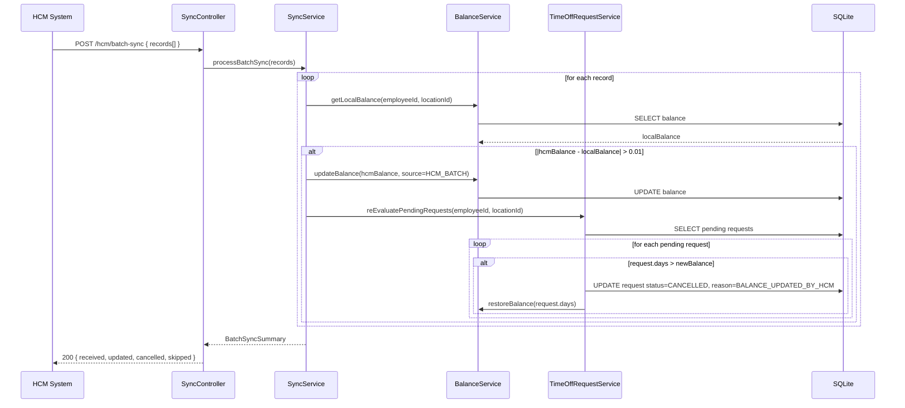

# Design Document: Time-Off Microservice

## Overview

The Time-Off Microservice is a NestJS application that manages employee time-off requests and balances for ExampleHR. It acts as a local cache and orchestration layer on top of an external HCM (Human Capital Management) system, which is the authoritative source of truth for employment data and balances.

The service handles the full lifecycle of a time-off request — from submission through approval or rejection — while maintaining defensively correct local balance state. It synchronizes with HCM in three modes: real-time (per-request), batch (bulk push from HCM), and scheduled conflict resolution (SyncJob). A deployable MockHCM server enables full integration and end-to-end testing without a real HCM dependency.

### Key Design Principles

- **Defensive correctness**: Never trust HCM success responses blindly. Always perform a post-write read to confirm committed balances.
- **Local balance as working state**: The local SQLite database holds the working balance. HCM is the source of truth; discrepancies are detected and resolved.
- **Reservation pattern**: When a request is submitted, the balance is immediately reserved (deducted locally). Approval confirms the deduction; rejection or cancellation restores it.
- **Structured error propagation**: All errors are returned as typed JSON with HTTP status codes that match the failure semantics.
- **Observability**: Every HCM interaction is logged at DEBUG level; discrepancies are recorded as auditable events.

---

## Architecture

### System Context



### Module Decomposition



| Module | Responsibility |
|---|---|
| `TimeOffRequestModule` | CRUD for TimeOffRequests, approval/rejection/cancellation workflow |
| `BalanceModule` | Balance storage, reservation, restoration, discrepancy recording |
| `HcmClientModule` | HTTP client for HCM with retry/backoff, request/response logging |
| `SyncModule` | Batch sync endpoint, SyncJob scheduler, ConflictResolver |
| `MockHcmModule` | Standalone NestJS app simulating HCM for tests |

### Component Interaction — Request Submission



### Component Interaction — Approval with HCM Sync



### Component Interaction — Batch Sync



---

## Components and Interfaces

### TimeOffRequestController

Handles all REST endpoints for time-off request management.

```typescript
@Controller('time-off-requests')
class TimeOffRequestController {
  @Post()
  create(@Body() dto: CreateTimeOffRequestDto): Promise<TimeOffRequestDto>

  @Get()
  list(@Query('employeeId') employeeId: string): Promise<TimeOffRequestDto[]>

  @Get(':id')
  findOne(@Param('id') id: string): Promise<TimeOffRequestDto>

  @Patch(':id/approve')
  approve(@Param('id') id: string): Promise<TimeOffRequestDto>

  @Patch(':id/reject')
  reject(@Param('id') id: string): Promise<TimeOffRequestDto>

  @Patch(':id/cancel')
  cancel(@Param('id') id: string): Promise<TimeOffRequestDto>
}
```

### BalanceController

Handles balance read, sync trigger, and discrepancy endpoints.

```typescript
@Controller('balances')
class BalanceController {
  @Get(':employeeId/:locationId')
  getBalance(
    @Param('employeeId') employeeId: string,
    @Param('locationId') locationId: string,
  ): Promise<BalanceDto>

  @Post(':employeeId/:locationId/sync')
  syncBalance(
    @Param('employeeId') employeeId: string,
    @Param('locationId') locationId: string,
  ): Promise<BalanceDto>

  @Get('discrepancies')
  getDiscrepancies(@Query() query: DiscrepancyQueryDto): Promise<BalanceDiscrepancyDto[]>
}
```

### SyncController

Receives batch sync payloads from HCM.

```typescript
@Controller('hcm')
class SyncController {
  @Post('batch-sync')
  batchSync(@Body() dto: BatchSyncDto): Promise<BatchSyncSummaryDto>
}
```

### HcmClient

Encapsulates all outbound HCM HTTP calls with retry logic.

```typescript
interface HcmClient {
  getBalance(employeeId: string, locationId: string): Promise<number>
  setBalance(employeeId: string, locationId: string, balance: number): Promise<void>
}
```

**Retry policy:**
- Retries on 5xx responses and network timeouts
- Maximum 3 retries
- Exponential backoff: 200ms, 400ms, 800ms (base × 2^attempt)
- No retry on 4xx responses
- Logs each attempt at DEBUG level with method, URL, status, attempt number

### BalanceService

Core balance management logic.

```typescript
interface BalanceService {
  getBalance(employeeId: string, locationId: string): Promise<Balance>
  reserveBalance(employeeId: string, locationId: string, days: number): Promise<Balance>
  restoreBalance(employeeId: string, locationId: string, days: number): Promise<Balance>
  updateBalance(employeeId: string, locationId: string, value: number, source: UpdateSource): Promise<Balance>
  recordDiscrepancy(event: BalanceDiscrepancyEvent): Promise<void>
  getDiscrepancies(filter: DiscrepancyFilter): Promise<BalanceDiscrepancy[]>
}
```

### TimeOffRequestService

Orchestrates request lifecycle, calling BalanceService and HcmClient.

```typescript
interface TimeOffRequestService {
  createRequest(dto: CreateTimeOffRequestDto): Promise<TimeOffRequest>
  listRequests(employeeId: string): Promise<TimeOffRequest[]>
  getRequest(id: string): Promise<TimeOffRequest>
  approveRequest(id: string): Promise<TimeOffRequest>
  rejectRequest(id: string): Promise<TimeOffRequest>
  cancelRequest(id: string): Promise<TimeOffRequest>
  reEvaluatePendingRequests(employeeId: string, locationId: string): Promise<CancelledCount>
}
```

### SyncService

Handles batch sync processing and the scheduled SyncJob.

```typescript
interface SyncService {
  processBatchSync(records: BatchSyncRecord[]): Promise<BatchSyncSummary>
  runConflictResolutionJob(): Promise<void>
}
```

---

## Data Models

### Entity: Balance

```typescript
@Entity('balances')
class Balance {
  @PrimaryGeneratedColumn('uuid')
  id: string

  @Column()
  employeeId: string

  @Column()
  locationId: string

  @Column('decimal', { precision: 10, scale: 2 })
  value: number

  @Column({ type: 'varchar', enum: UpdateSource })
  lastUpdateSource: UpdateSource  // 'EMPLOYEE_REQUEST' | 'HCM_REALTIME' | 'HCM_BATCH' | 'HCM_CONFLICT_RESOLUTION'

  @CreateDateColumn()
  createdAt: Date

  @UpdateDateColumn()
  updatedAt: Date

  @Index()
  @Column({ unique: false })
  // Composite unique index on (employeeId, locationId)
}
```

**Constraints:**
- `UNIQUE(employeeId, locationId)` — one balance record per dimension
- `CHECK(value >= 0)` — non-negative enforcement at DB level
- `value` stored as `DECIMAL(10,2)` — up to two decimal places

### Entity: TimeOffRequest

```typescript
@Entity('time_off_requests')
class TimeOffRequest {
  @PrimaryGeneratedColumn('uuid')
  id: string

  @Column()
  employeeId: string

  @Column()
  locationId: string

  @Column('date')
  startDate: string  // ISO 8601 date string

  @Column('date')
  endDate: string    // ISO 8601 date string

  @Column('decimal', { precision: 10, scale: 2 })
  days: number

  @Column({ type: 'varchar', enum: RequestStatus })
  status: RequestStatus  // 'PENDING' | 'APPROVED' | 'REJECTED' | 'CANCELLED'

  @Column({ nullable: true })
  cancellationReason: string | null  // 'EMPLOYEE_CANCELLED' | 'BALANCE_UPDATED_BY_HCM'

  @CreateDateColumn()
  submittedAt: Date

  @UpdateDateColumn()
  updatedAt: Date
}
```

### Entity: BalanceDiscrepancy

```typescript
@Entity('balance_discrepancies')
class BalanceDiscrepancy {
  @PrimaryGeneratedColumn('uuid')
  id: string

  @Column()
  employeeId: string

  @Column()
  locationId: string

  @Column('decimal', { precision: 10, scale: 2 })
  localValue: number

  @Column('decimal', { precision: 10, scale: 2 })
  hcmValue: number

  @Column({ type: 'varchar' })
  resolutionAction: string  // 'LOCAL_UPDATED_TO_HCM' | 'WARNING_LOGGED'

  @Column({ type: 'varchar' })
  detectedDuring: string  // 'REALTIME_SYNC' | 'BATCH_SYNC' | 'POST_WRITE_READ' | 'CONFLICT_RESOLUTION'

  @CreateDateColumn()
  detectedAt: Date
}
```

### Database Schema (SQLite DDL)

```sql
CREATE TABLE balances (
  id TEXT PRIMARY KEY,
  employee_id TEXT NOT NULL,
  location_id TEXT NOT NULL,
  value REAL NOT NULL CHECK(value >= 0),
  last_update_source TEXT NOT NULL,
  created_at DATETIME NOT NULL DEFAULT CURRENT_TIMESTAMP,
  updated_at DATETIME NOT NULL DEFAULT CURRENT_TIMESTAMP,
  UNIQUE(employee_id, location_id)
);

CREATE TABLE time_off_requests (
  id TEXT PRIMARY KEY,
  employee_id TEXT NOT NULL,
  location_id TEXT NOT NULL,
  start_date TEXT NOT NULL,
  end_date TEXT NOT NULL,
  days REAL NOT NULL CHECK(days > 0),
  status TEXT NOT NULL CHECK(status IN ('PENDING','APPROVED','REJECTED','CANCELLED')),
  cancellation_reason TEXT,
  submitted_at DATETIME NOT NULL DEFAULT CURRENT_TIMESTAMP,
  updated_at DATETIME NOT NULL DEFAULT CURRENT_TIMESTAMP
);

CREATE INDEX idx_tor_employee ON time_off_requests(employee_id);
CREATE INDEX idx_tor_status ON time_off_requests(status);

CREATE TABLE balance_discrepancies (
  id TEXT PRIMARY KEY,
  employee_id TEXT NOT NULL,
  location_id TEXT NOT NULL,
  local_value REAL NOT NULL,
  hcm_value REAL NOT NULL,
  resolution_action TEXT NOT NULL,
  detected_during TEXT NOT NULL,
  detected_at DATETIME NOT NULL DEFAULT CURRENT_TIMESTAMP
);

CREATE INDEX idx_disc_employee ON balance_discrepancies(employee_id);
CREATE INDEX idx_disc_detected_at ON balance_discrepancies(detected_at);
```

### API DTOs

**CreateTimeOffRequestDto**
```typescript
{
  employeeId: string       // required, non-empty
  locationId: string       // required, non-empty
  startDate: string        // required, ISO 8601 date (YYYY-MM-DD)
  endDate: string          // required, ISO 8601 date >= startDate
  days: number             // required, > 0, up to 2 decimal places
}
```

**TimeOffRequestDto** (response)
```typescript
{
  id: string
  employeeId: string
  locationId: string
  startDate: string
  endDate: string
  days: number
  status: 'PENDING' | 'APPROVED' | 'REJECTED' | 'CANCELLED'
  cancellationReason: string | null
  submittedAt: string      // ISO 8601 datetime
  updatedAt: string
}
```

**BalanceDto** (response)
```typescript
{
  employeeId: string
  locationId: string
  value: number
  lastUpdateSource: string
  updatedAt: string
}
```

**BatchSyncDto** (request)
```typescript
{
  records: Array<{
    employeeId: string
    locationId: string
    balance: number
  }>
}
```

**BatchSyncSummaryDto** (response)
```typescript
{
  received: number
  updated: number
  cancelled: number
  skipped: number
}
```

**Error response shape** (all error responses)
```typescript
{
  statusCode: number
  error: string            // machine-readable error code, e.g. "INSUFFICIENT_BALANCE"
  message: string          // human-readable description
  details?: object         // optional context (e.g., { available: 3, requested: 5 })
}
```

---

## HCM Client Module

### Configuration

Configured via environment variables:

| Variable | Default | Description |
|---|---|---|
| `HCM_BASE_URL` | `http://localhost:3001` | Base URL of the HCM API |
| `HCM_TIMEOUT_MS` | `5000` | Request timeout in milliseconds |
| `HCM_MAX_RETRIES` | `3` | Maximum retry attempts for 5xx/timeout |
| `HCM_RETRY_BASE_MS` | `200` | Base delay for exponential backoff |

### Retry Logic

```
attempt 0: immediate
attempt 1: wait 200ms
attempt 2: wait 400ms
attempt 3: wait 800ms
→ throw HcmUnavailableException after attempt 3 fails
```

On 4xx: throw `HcmClientException` immediately, no retry.

### Logging

Every request/response pair is logged at DEBUG:
```
[HcmClient] GET /hcm/balances/emp-1/loc-us → 200 { balance: 10.00 } (attempt 1, 45ms)
[HcmClient] PUT /hcm/balances/emp-1/loc-us → 503 (attempt 2, 5012ms timeout)
```

On final failure:
```
[HcmClient] FAILED GET /hcm/balances/emp-1/loc-us after 3 attempts, last status: 503
```

---

## Sync Strategies

### Real-Time Sync (Pre-Approval)

Triggered when a manager approves a request. The flow:

1. Fetch HCM balance for the dimension.
2. If `|hcmBalance - localBalance| > 0.01`, update local balance and record source as `HCM_REALTIME`.
3. Re-evaluate the pending request against the (possibly updated) balance.
4. If still sufficient, proceed with deduction and approval.
5. After HCM PUT succeeds, perform a post-write read (GET) to confirm the committed balance.
6. If post-write balance differs from expected by > 0.01, log a warning and record a `BalanceDiscrepancy` event, then update local balance to the confirmed HCM value.

### Batch Sync (HCM Push)

Triggered by `POST /hcm/batch-sync`. The flow:

1. Validate each record: skip records with negative balance or unrecognized dimension (log warning, increment skipped count).
2. For each valid record, compare HCM value to local value.
3. If `|hcmBalance - localBalance| > 0.01`, update local balance with source `HCM_BATCH`.
4. For each updated dimension, call `reEvaluatePendingRequests`: cancel any PENDING requests that now exceed the new balance, restoring their reserved days.
5. Return `BatchSyncSummary`.

### Scheduled Conflict Resolution (SyncJob)

Runs on a configurable cron schedule (default: every hour). The flow:

1. Query all dimensions (employeeId + locationId pairs) that have had a local balance update within the past 24 hours.
2. For each dimension, fetch the HCM balance.
3. If `|hcmBalance - localBalance| > 0.01`, update local balance with source `HCM_CONFLICT_RESOLUTION` and record a `BalanceDiscrepancy` event.
4. Re-evaluate pending requests for any updated dimension.

### Defensive Post-Write Read

After every successful HCM PUT (balance deduction), the service immediately issues a GET to confirm the committed value. This guards against HCM silently accepting invalid operations or applying its own transformations.

```
expected = localBalance - requestedDays
actual   = GET /hcm/balances/{employeeId}/{locationId}

if |actual - expected| > 0.01:
  log WARNING with { employeeId, locationId, expected, actual }
  record BalanceDiscrepancy(detectedDuring: 'POST_WRITE_READ')
  update local balance to actual
```

---

## Mock HCM Server

The MockHCM is a standalone NestJS application (`MockHcmModule`) that can be started on a configurable port. It maintains in-memory state.

### Endpoints

| Method | Path | Description |
|---|---|---|
| `GET` | `/hcm/balances/:employeeId/:locationId` | Return current balance for dimension |
| `PUT` | `/hcm/balances/:employeeId/:locationId` | Set balance; validates non-negative result |
| `POST` | `/hcm/simulate/balance-change` | Directly set a balance (simulates independent HCM update) |
| `POST` | `/hcm/simulate/error` | Configure error injection for next N requests to a dimension |
| `DELETE` | `/hcm/reset` | Reset all in-memory state |

### Error Injection

`POST /hcm/simulate/error` body:
```typescript
{
  employeeId: string
  locationId: string
  statusCode: number   // e.g. 503, 422
  times: number        // number of requests to affect
}
```

When a request arrives for a dimension with an active error injection, the MockHCM returns the configured status code and decrements the counter.

### In-Memory State Shape

```typescript
interface MockHcmState {
  balances: Map<string, number>          // key: `${employeeId}:${locationId}`
  errorInjections: Map<string, { statusCode: number; remaining: number }>
}
```

### Validation

PUT requests that would result in a negative balance return:
```json
{ "statusCode": 422, "error": "INSUFFICIENT_BALANCE", "available": <current_balance> }
```

---

## Error Handling

### Exception Hierarchy

```
AppException (base)
├── ValidationException (400)
├── NotFoundException (404)
├── ConflictException (409)
├── UnprocessableException (422)
│   ├── InsufficientBalanceException
│   └── NegativeBalanceException
├── HcmClientException (502)
│   └── HcmErrorResponseException
└── HcmUnavailableException (503)
```

### Global Exception Filter

A NestJS `ExceptionFilter` catches all `AppException` subclasses and formats them as:

```json
{
  "statusCode": 422,
  "error": "INSUFFICIENT_BALANCE",
  "message": "Requested 5.00 days exceeds available balance of 3.00 days",
  "details": { "available": 3.00, "requested": 5.00 }
}
```

Unhandled exceptions are caught and returned as 500 with a generic message (no stack trace in production).

### Status Code Mapping

| Scenario | HTTP Status |
|---|---|
| Missing required field | 400 |
| Resource not found | 404 |
| Request not in PENDING status | 409 |
| Insufficient balance | 422 |
| Negative balance value | 422 |
| End date before start date | 422 |
| HCM returned 4xx error | 502 |
| HCM unavailable / retries exhausted | 503 |

---

## Testing Strategy

### Unit Tests

- `BalanceService`: reservation, restoration, discrepancy recording, tolerance comparison
- `TimeOffRequestService`: state machine transitions, re-evaluation logic
- `HcmClient`: retry logic, backoff timing, 4xx no-retry behavior
- `SyncService`: batch record validation, skipping logic, summary calculation
- `ConflictResolver`: higher/lower balance detection, pending request re-evaluation

### Integration Tests (with MockHCM)

Using the MockHCM started as a real HTTP server:

1. **Successful approval flow**: submit → approve → verify HCM PUT called → verify post-write read
2. **HCM error on approval**: configure MockHCM to return 503 → approve → verify request rejected, balance restored
3. **HCM independent balance change + re-sync**: simulate balance change via MockHCM → trigger sync → verify local balance updated
4. **Batch sync with cancelled pending requests**: submit requests → batch sync with lower balance → verify requests cancelled, balance restored
5. **Post-write read discrepancy**: configure MockHCM to return unexpected value after PUT → verify discrepancy recorded

### End-to-End Tests

Full HTTP round-trips against a running TimeOffService instance with MockHCM:

- Complete employee workflow: create balance → submit request → manager approves → verify final state
- Cancellation workflow: submit → cancel → verify balance restored
- Batch sync workflow: seed balances → POST batch-sync → verify summary and state

### Property-Based Tests (fast-check)

See Correctness Properties section below for the formal properties. Implementation notes:

- Use `fast-check` library
- Minimum 100 runs per property (`numRuns: 100`)
- Tag each test with a comment: `// Feature: time-off-microservice, Property N: <property text>`
- Use in-memory SQLite (`:memory:`) for speed
- MockHCM started in-process for property tests

### Regression Tests

Each bug fix gets a test named `regression-{issue-id}: <description>` that reproduces the exact failure condition before the fix.

---


## Correctness Properties

*A property is a characteristic or behavior that should hold true across all valid executions of a system — essentially, a formal statement about what the system should do. Properties serve as the bridge between human-readable specifications and machine-verifiable correctness guarantees.*

The following properties are derived from the acceptance criteria. Each is universally quantified and suitable for property-based testing with `fast-check`.

---

### Property 1: Balance Conservation Invariant

*For any* employee/location dimension with an initial balance B, and any sequence of valid time-off request submissions and approvals, the sum of all approved request days plus the current local balance must equal B.

Formally: `initialBalance = sum(approved[i].days) + currentBalance`

This property subsumes the reservation (balance decreases on PENDING), approval idempotence (no double-deduction), and restoration (balance increases on REJECTED or CANCELLED) behaviors.

**Validates: Requirements 3.3, 3.4, 3.5, 2.5, 12.1**

---

### Property 2: Insufficient Balance Always Rejected

*For any* local balance value B (≥ 0) and any time-off request for D days where D > B, submitting the request must result in a 422 Unprocessable Entity response containing the current available balance and the requested amount.

**Validates: Requirements 3.2, 12.4**

---

### Property 3: Balance Update Records Correct Source and Timestamp

*For any* balance update operation (real-time sync, batch sync, or conflict resolution), the resulting balance record must have `lastUpdateSource` set to the appropriate source value (`HCM_REALTIME`, `HCM_BATCH`, or `HCM_CONFLICT_RESOLUTION`) and `updatedAt` must be a timestamp greater than or equal to the timestamp before the update.

**Validates: Requirements 1.4, 5.2, 6.3, 8.2, 8.3**

---

### Property 4: Pending Request Re-Evaluation After Balance Change

*For any* balance change operation (batch sync, conflict resolution, or real-time sync) that reduces the balance for a dimension, every PENDING time-off request for that dimension whose `days` value exceeds the new balance must be transitioned to CANCELLED with reason `BALANCE_UPDATED_BY_HCM`, and the reserved days must be restored to the balance.

**Validates: Requirements 6.4, 6.5, 8.4, 8.5**

---

### Property 5: Batch Sync Non-Negativity Invariant

*For any* batch sync payload (including payloads with mixed valid and invalid records), after processing completes, no local balance value for any dimension must be negative.

**Validates: Requirements 6.1, 6.2, 12.3**

---

### Property 6: HCM Balance Round-Trip

*For any* valid balance value V (non-negative, up to 2 decimal places), writing V to the MockHCM via PUT and then reading it back via GET must return a value W such that `|V - W| ≤ 0.01`.

**Validates: Requirements 10.2, 12.2**

---

### Property 7: HCM Retry Behavior

*For any* HCM request that receives a 5xx response or network timeout, the client must retry the request up to 3 times with exponential backoff delays of 200ms, 400ms, and 800ms respectively, and must not retry on 4xx responses.

Formally: for 5xx/timeout, `retryCount = 3` and `delay[i] = 200 * 2^i ms`. For 4xx, `retryCount = 0`.

**Validates: Requirements 9.2, 9.5**

---

### Property 8: Post-Write Read Discrepancy Detection

*For any* scenario where the HCM balance returned by the post-write read differs from the expected post-deduction value by more than 0.01 days, the service must update the local balance to match the confirmed HCM value and record a `BalanceDiscrepancy` event with `detectedDuring = 'POST_WRITE_READ'`.

**Validates: Requirements 7.2, 7.3, 7.4**

---

### Property 9: Discrepancy Event Completeness

*For any* detected balance discrepancy (during any sync operation or post-write read), the recorded `BalanceDiscrepancy` event must contain non-null values for: `employeeId`, `locationId`, `localValue`, `hcmValue`, `resolutionAction`, `detectedDuring`, and `detectedAt`.

**Validates: Requirements 7.5**

---

### Property 10: Request List Ordering and Filtering

*For any* set of time-off requests across multiple employees, querying `GET /time-off-requests?employeeId={id}` must return only requests belonging to that employee, and the results must be ordered by `submittedAt` descending (most recent first).

**Validates: Requirements 2.4**

---

### Property 11: State Machine Conflict Rejection

*For any* time-off request in a non-PENDING status (APPROVED, REJECTED, or CANCELLED), attempting to approve or reject that request must return a 409 Conflict response indicating the current status.

**Validates: Requirements 4.5**

---

### Property 12: Conflict Resolution Converges Local to HCM

*For any* dimension where the HCM balance differs from the local balance (in either direction), running the ConflictResolver must update the local balance to exactly the HCM value and record `lastUpdateSource = 'HCM_CONFLICT_RESOLUTION'`.

**Validates: Requirements 8.2, 8.3**

---

### Property 13: Batch Sync Summary Accuracy

*For any* batch sync payload, the returned summary must satisfy: `received = total records in payload`, `updated = count of records where |hcmBalance - localBalance| > 0.01 and record is valid`, `cancelled = count of PENDING requests cancelled due to insufficient balance`, `skipped = count of records with invalid dimension or negative balance`.

**Validates: Requirements 6.6, 6.7, 6.8**

---

### Property 14: Missing Required Field Returns 400 with Field Details

*For any* API request that omits one or more required fields, the response must be 400 Bad Request with a body that lists each missing field and its expected type.

**Validates: Requirements 11.2**

---

### Property 15: Semantic Validation Returns 422

*For any* API request with valid structure but semantically invalid data (end date before start date, non-positive days value, balance value with more than 2 decimal places), the response must be 422 Unprocessable Entity with a descriptive error message.

**Validates: Requirements 1.5, 1.6, 11.3**

---

### Property 16: Not Found Returns 404 with Resource Info

*For any* request referencing an unknown employeeId, locationId, or request ID, the response must be 404 Not Found with a body containing the resource type and the identifier that was not found.

**Validates: Requirements 11.5**

---

### Property 17: All Responses Are JSON

*For any* request to any endpoint, the response must have `Content-Type: application/json` and a valid JSON body.

**Validates: Requirements 11.4**

---

## Error Handling (continued)

### Structured Error Response Examples

**Insufficient balance (422):**
```json
{
  "statusCode": 422,
  "error": "INSUFFICIENT_BALANCE",
  "message": "Requested 5.00 days exceeds available balance of 3.00 days",
  "details": { "available": 3.00, "requested": 5.00 }
}
```

**HCM unavailable (503):**
```json
{
  "statusCode": 503,
  "error": "HCM_UNAVAILABLE",
  "message": "HCM service is unavailable after 3 retry attempts",
  "details": { "employeeId": "emp-1", "locationId": "loc-us", "attempts": 3 }
}
```

**State conflict (409):**
```json
{
  "statusCode": 409,
  "error": "INVALID_STATUS_TRANSITION",
  "message": "Cannot approve a request with status APPROVED",
  "details": { "currentStatus": "APPROVED", "requestedAction": "approve" }
}
```

**Not found (404):**
```json
{
  "statusCode": 404,
  "error": "NOT_FOUND",
  "message": "TimeOffRequest with id 'abc-123' not found",
  "details": { "resourceType": "TimeOffRequest", "id": "abc-123" }
}
```

**Missing field (400):**
```json
{
  "statusCode": 400,
  "error": "VALIDATION_ERROR",
  "message": "Request validation failed",
  "details": {
    "fields": [
      { "field": "startDate", "expectedType": "string (ISO 8601 date)", "issue": "missing" },
      { "field": "days", "expectedType": "number (> 0)", "issue": "missing" }
    ]
  }
}
```
